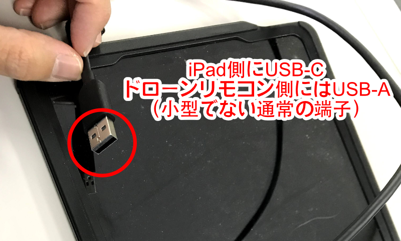
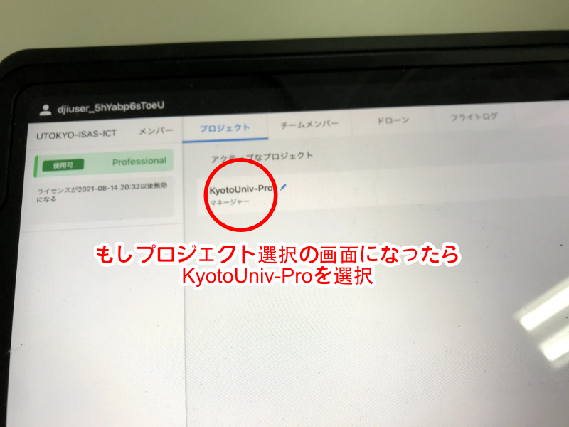
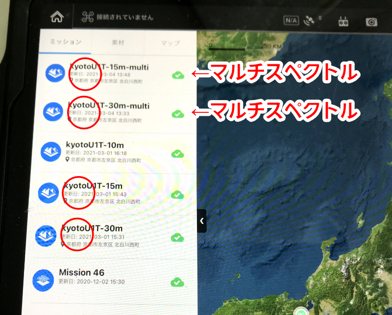
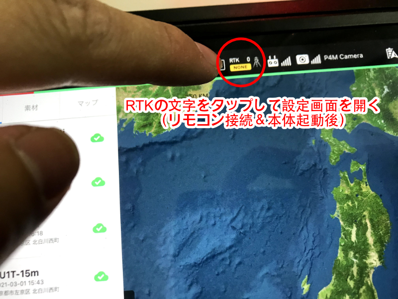

# フェノタイピングオペレーションマニュアル 2021ByKen

Version 20210308 for XX_Univ. case

### 用意する機材

##### ドローン

- Phantom4 RTK
  - ★ 4\* バッテリー（専用 AC アダプタで一度に 3 つまで充電）
  - ★ プロポ i.e.リモコン（本体バッテリーと兼用の AC アダプタから充電）
  - MicroSD カード 128GB
- Phantom4 Multispectral
  - ★ 4\* バッテリー（専用 AC アダプタで一度に 3 つまで充電）
  - ★ プロポ（本体バッテリーと兼用の AC アダプタから充電）
  - MicroSD カード 128GB
- ★ iPad Air（USB-C）
  - プロポと接続するために USB-A to USB-C のケーブルを使用

### ドローン撮影

- Phantom4 Multispectral （カメラが大型で 6 つレンズがついている）と Phantom4 RTK （カメラが小型でレンズが 1 つのみ）の二台を用いる
- 二台それぞれを 15m と 30m の高度で飛行させるため合計 4 フライト実施する
  - 15m での飛行は途中でバッテリー交換が必要となる

#### 飛行準備

- 工事や圃場作業で GCP および地面に赤スプレーでつけたマーカーが隠されていないことを確認する（隠されていたらなるべくどけてもらう）
- ケースからドローンを取り出し、ジンバルカバー（カメラカバー）を取り外し、プロペラを装着する
- リモコンと iPad を USB ケーブルで接続する
  
- 本体とリモコンの電源を入れる

##### フライトプラン読み込み

- iPad で GS Pro アプリを起動
  - DJI アカウントとログイン済みは必要
  - 必要であればチームを選択する
    
- 以下の 4 つのフライトを実施するため、順に読み込む
  - "kyotoU1T-30m-multi" Phantom4 multispectral 高度 30m
  - "kyotoU1T-15m-multi" Phantom4 multispectral 高度 15m
  - "kyotoU1T-30m" Phantom4 RTK 高度 30m
  - "kyotoU1T-15m" Phantom4 RTK 高度 15m
    
- 圃場 6 枚全部を飛ぶ領域設定になっていることを確認（防草シートを張っている 3 枚のみではない）
  - 「マスター」の設定は狭い領域で不適切。「私の」の設定を使う必要がある
- RTK GPS サービス は ichimill に接続する
  
  
  - アカウントは設定済みなので ichimill を選んで接続ボタンを押すだけ（D-RTK2 となっていたら違うものが選択されているので切り替える）
  - RTK fix の表示になったら飛行可能。Single や RTK float ではだめ
    - 開けて電波の入りの良い場所だと fix になりやすい
- Phantom4 RTK（カメラが小型のほう）はフライトプランはそのままでよいのであとはカメラ設定だけ
- Phantom4 Multispectral（カメラが大型のほう）はフライトパスの方位のみ毎回自動で設定する
- Phantom4 Multispectral のカメラのプレビューとしてマルチスペクトルの画像が出ていると RGB 画像が保存できないので、プレビューはあくまで RGB にする

#### カメラ設定（Phantom4 RTK のみ）

- 自動または手動（両スティックを内側下向きいっぱいに倒すとプロペラ始動）で離陸させ、圃場の中央付近でホバリングさせる
- リモコンの左ダイヤルでカメラを真下に向けて露出を確認する。-1.3~1.7EV 程度になるのが望ましい
  - 絞り F 値は 5 以上（大きいほど暗くなり EV がマイナスになる）
  - シャッタースピードは 1/500 かそれより短く（短くすると暗くなり EV がマイナスになる）
  - ISO は 100 が望ましいが、絞りとシャッタースピードの都合でやむを得なければ 200 にする
- 設定できたら空中でそのままフライトプランを開始できる

#### フライト中

- 目視で飛行を監視して様子がおかしければ手動操縦で安全を確保する
  - リモコン左側のモード選択スライドスイッチをいったん左に動かしてから右端に戻すと自動操縦が解除できる
- 西側は敷地外に出るぎりぎりまで接近するので特に注意（西側を飛ぶときは操縦者も西側端付近に立つようにする）
- バッテリーが少なくなるとしばらくのあいだ低電力の警告が出たあと自動で帰還・着陸する
  - その際は電源を切り、バッテリーを交換して電源を入れ、ふたたび RTK GPS が fix になったら続きからフライトさせる
  - 続きからフライトさせるときに Phantom4 Multispectral ではフライトパスの方位の警告が再び出ることがあるが、このときは警告を無視してそれまでの方位を維持する
